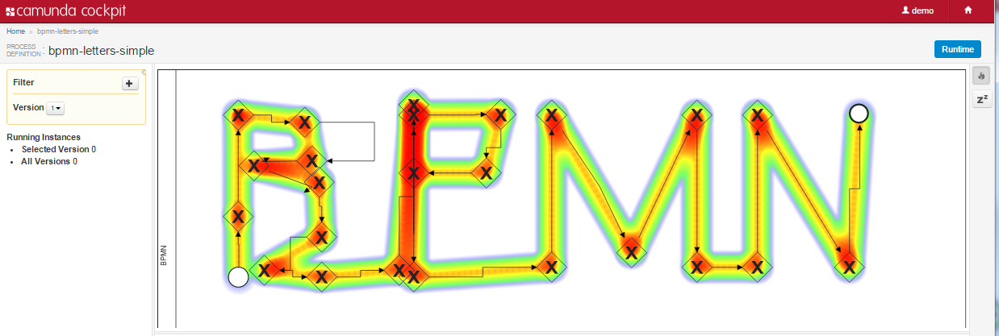
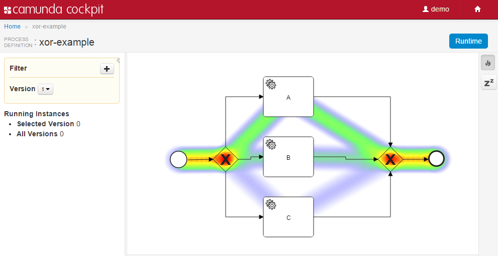

    
    <h1 align="center">Camunda Cockpit Heatmap Plugin</h1>

This is a simple [camunda](http://www.camunda.org) cockpit plugin that showcases, how you can retrieve simple historic statistics data and add some fancy visualization on the process definition view.

For this plugin, my idea was simple tranfer historic data to a background-layer of the process diagramm and show a heatmap on sequence flows. By using a heatmap, it is possible to demonstrate, where the process was flowing most often. The more heat a sequence gets, the more relevant is this flow to the process.

You can also think of process mining that way. By realizing the flow with the most heat, you should compare this with your requirements and you are able do a variance analysis between the previously thought common flow and the actual data.

I have some process models, I was using during development in my other repository. See the sources in [https://github.com/allanavelar/camunda-examples/tree/master/camunda-heatmap-examples](https://github.com/allanavelar/camunda-examples/tree/master/camunda-heatmap-examples)

Using third-party [heatmap.js](https://github.com/pa7/heatmap.js)